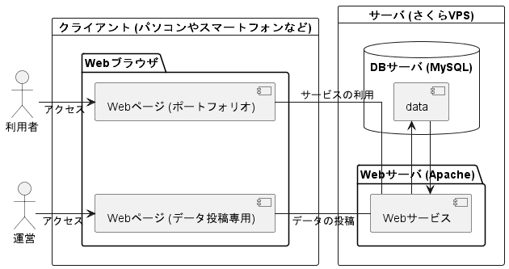

# 基本設計書

| バージョン | 更新日     | 更新者                                    |
| ---------- | ---------- | ----------------------------------------- |
| 1.00       | 2023/07/03 | [nekkiChan](https://github.com/nekkiChan) |

---

## 目次

- [基本設計書](#基本設計書)
  - [目次](#目次)
  - [基本設計](#基本設計)
    - [システム構成](#システム構成)
      - [システム構成イメージ](#システム構成イメージ)
      - [サーバ構成](#サーバ構成)
    - [機能一覧](#機能一覧)
    - [画面仕様](#画面仕様)
    - [データベース定義](#データベース定義)
  - [他のページへ](#他のページへ)
  - [更新履歴](#更新履歴)

---

## 基本設計

### システム構成

#### システム構成イメージ

#### サーバ構成

| 分類               | 内容       | バージョン |
| ------------------ | ---------- | ---------- |
| サーバ             | さくら VPS | 5          |
| Web サーバ         | Apache     | 2.4.57     |
| データベースサーバ | MySQL      | 8.0        |
| 開発言語           | PHP        | 8.2        |
| フレームワーク     | 使用しない |            |

### 機能一覧

[画面設計書](./screen_design_document.md)を参照。

### 画面仕様

[画面設計書](./screen_design_document.md)を参照。

### データベース定義

[データベース定義書](./database_definition_document.md)を参照。

---

## 他のページへ

- [README](../README.md)
- [要件定義書](./requirement_definition_document.md)
- [画面設計書](./screen_design_document.md)
- [データベース定義書](./database_definition_document.md)
- [テスト仕様書兼報告書](./test_specification_and_report.md)

---

## 更新履歴

| バージョン | 作成/更新日 | 該当箇所                                                  | 更新内容                                          | 更新者                                    |
| ---------- | ----------- | --------------------------------------------------------- | ------------------------------------------------- | ----------------------------------------- |
| 0.01       | 2023/07/02  | 基本設計書作成                                            | ドラフト                                          | [nekkiChan](https://github.com/nekkiChan) |
| 0.02       | 2023/07/02  | ~~他ページへの項目を作成~~ [他ページへ](#他のページへ) | ~~ドラフト~~ [他ページへ](#他のページへ)を作成 | [nekkiChan](https://github.com/nekkiChan) |
| 0.03       | 2023/07/03  | [更新履歴](#更新履歴)                                     | バージョン 0.02 の修正                            | [nekkiChan](https://github.com/nekkiChan) |
| 1.00       | 2023/07/04  | [目次](#目次)、[基本設計](#基本設計)                      | [目次](#目次)、[基本設計](#基本設計)を作成        | [nekkiChan](https://github.com/nekkiChan) |
